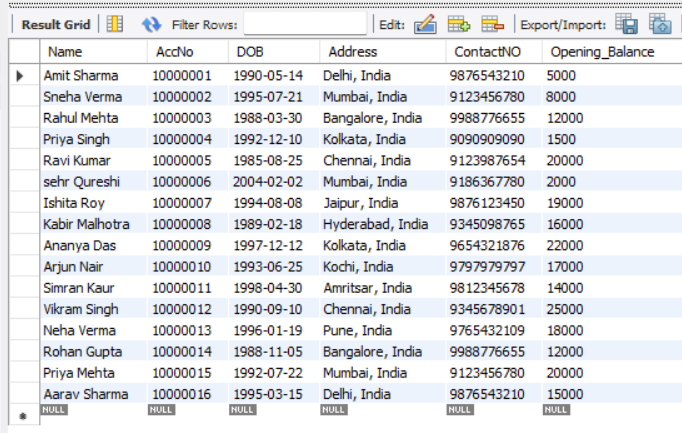

# 🏦 Bank Management System (Python + MySQL)

## 📖 Project Overview
This project is a **Bank Management System** built with **Python (for logic)** and **MySQL (for data storage)**.  
It simulates real-world banking operations, enabling users to perform **account management and transaction handling** through a command-line interface.  

The system is designed with **data integrity, usability, and persistence** in mind, making it a great foundation for understanding **database-driven applications**.

---

## ✨ Key Features
- **Account Creation** → Auto-generates unique 8-digit account numbers.  
- **Transaction Handling** → Deposit and withdraw funds securely with balance validation.  
- **Balance Enquiry** → Retrieve real-time balance for any account.  
- **Customer Information** → Display account holder details with one query.  
- **Account Closure** → Securely delete accounts with confirmation.  
- **Database Integration** → Persistent data storage in MySQL.  

---

## 🗂️ Database Design
The project uses a **normalized database schema** to ensure clarity and data consistency:

1. **`account_table`** – Stores personal and static account details.  
2. **`amount_table`** – Stores financial data and is updated after each transaction.  

This separation ensures **data modularity**, making it easier to track customer details and balances independently.

---

## ⚙️ Tech Stack
- **Programming Language:** Python 3.x  
- **Database:** MySQL  
- **Connector:** `mysql-connector-python`  

Install requirements:
```bash
pip install mysql-connector-python
```
---

## 📸 Preview
 
---

## ▶️ How to Run
1. Import the SQL schema into MySQL:
   ```sql
   SOURCE bank_management.sql;
   ```

2. Update credentials inside the Python script:
   ```python
   conn = mysql.connector.connect(
       host="localhost",
       user="root",
       password="YOUR_PASSWORD",
       database="BANK_MANAGEMENT"
   )
   ```

3. Run the program:
   ```bash
   python bank_management.py
   ```

---

## 🔎 Findings & Insights
- **Data Validation** – Implemented error handling for invalid accounts and insufficient balances.  
- **Scalability** – Separated tables for accounts and balances, making the system extensible for features like transaction history.  
- **Efficiency** – Used direct SQL queries for CRUD operations, ensuring fast execution.  
- **Reliability** – Added confirmation before critical actions (like account closure).  

---

## 🚀 Challenges & Solutions
- **Challenge:** Handling duplicate account numbers.  
  **Solution:** Used `MAX(AccNo) + 1` logic to always generate unique IDs.  

- **Challenge:** Ensuring consistent balance updates across deposits/withdrawals.  
  **Solution:** Transactions are committed only after successful SQL execution.  

- **Challenge:** Preventing accidental data loss.  
  **Solution:** Account closure requires explicit user confirmation.  

---

## 📈 Outcomes & Impact
- Simplified banking operations in a **digital format**.  
- Provided a **learning foundation** for database-driven applications.  
- Enhanced understanding of **Python-MySQL integration**.  
- Built a base that can be extended into **web apps or GUIs**.  

---

## 🌟 Future Improvements
- Add **user authentication & roles (Admin/Customer)**.  
- Maintain **transaction history logs** for transparency.  
- Build a **GUI (Tkinter/Flask/Django)** for better usability.  
- Deploy on **cloud with remote database access**.  

---

## ⭐ Support
If you find this project useful, please consider giving it a **star ⭐** on GitHub — it motivates me to improve and share more projects!  
